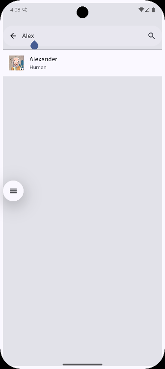

# Wubba Lubba App-App

**Wubba Lubba App-App** is a native Android application that explores the Rick and Morty universe. This project serves as a showcase for a modern Android stack, focusing on GraphQL consumption, reactive UI with **Jetpack Compose**, and a robust dependency injection architecture.


## Tech Stack & Libraries

This project is built with the "AAA" modern Android stack:

- [Kotlin](https://kotlinlang.org) - Core language.
- [Jetpack Compose](https://developer.android.com/compose) - Declarative UI framework.
- [Apollo Kotlin (v4.3.3)](https://www.apollographql.com/docs/kotlin) - A strongly-typed GraphQL client that generates Kotlin models from queries.
- [Hilt (v2.57.2)](https://developer.android.com/training/dependency-injection/hilt-android) - Dependency injection for modularity and testability.
- [Coroutines & Flow](https://kotlinlang.org/docs/coroutines-overview.html) - Asynchronous programming and reactive data streams.
- [Coil (v2.7.0)](https://coil-kt.github.io/coil/) - Image loading optimized for Compose.
- [Jetpack Navigation](https://developer.android.com/guide/navigation) - Type-safe navigation integrated with Hilt ViewModels.
- [OkHttp Logging Interceptor](https://github.com/square/okhttp) - Network debugging for GraphQL POST requests.


## Architecture

The app implements Clean Architecture principles and the **MVI (Model-View-Intent)** pattern:

- **UI Layer**: Uses `LazyColumn` for efficient list rendering and `rememberLazyListState` for infinite scroll detection.
- **State Management**: ViewModels leverage `mutableStateOf` for atomic state updates and `SavedStateHandle` for seamless argument passing between screens.
- **Data Layer**: Repositories encapsulate `ApolloClient` logic, handling both raw data for pagination and specific entity queries.


## Key Features

- [x] **Infinite Scrolling**: Automatically fetches the next page of characters as the user scrolls.
- [x] **GraphQL Search**: Dynamic filtering by character name directly through GraphQL queries.
- [x] **Detailed Character View**: Deep-dive into character origins and their appearances in specific episodes.
- [x] **Modern UI/UX**: Material Design 3 (M3) support with Light/Dark mode compatibility.
- [x] **Type-Safe Navigation**: Passing IDs between screens using the latest Navigation Compose practices.


## Getting Started

1. **Clone the repository**:
```git
git clone https://github.com/danielvilha/kotlin-wubba-lubba.git
```
2. **Open in Android Studio**: Recommended version: **Ladybug** or higher.
3. **Generate Apollo Sources**: Before running, the Apollo Kotlin plugin must generate the models from your `.graphql` files:
```
./gradlew generateApolloSources
```
4. **Run the App**: Deploy to an emulator or physical device.


## Evolution Note

As a developer who started back in the **Android 2.3 (Gingerbread)** era, this project represents the bridge between legacy experience and the cutting edge of mobile development—transitioning from `ListViews` and `AsyncTasks` to **GraphQL** and **Declarative UIs**.


## Screenshots
||||


## Author
**Daniel Vilha**
*   [LinkedIn](https://www.linkedin.com/in/danielvilha/)
*   [GitHub](https://github.com/danielvilha)


## License
Copyright 2026 Daniel Vilha

Permission is hereby granted, free of charge, to any person obtaining a copy of this software and associated documentation files (the “Software”), to deal in the Software without restriction, including without limitation the rights to use, copy, modify, merge, publish, distribute, sublicense, and/or sell copies of the Software, and to permit persons to whom the Software is furnished to do so, subject to the following conditions:

The above copyright notice and this permission notice shall be included in all copies or substantial portions of the Software.

THE SOFTWARE IS PROVIDED “AS IS”, WITHOUT WARRANTY OF ANY KIND, EXPRESS OR IMPLIED, INCLUDING BUT NOT LIMITED TO THE WARRANTIES OF MERCHANTABILITY, FITNESS FOR A PARTICULAR PURPOSE AND NONINFRINGEMENT. IN NO EVENT SHALL THE AUTHORS OR COPYRIGHT HOLDERS BE LIABLE FOR ANY CLAIM, DAMAGES OR OTHER LIABILITY, WHETHER IN AN ACTION OF CONTRACT, TORT OR OTHERWISE, ARISING FROM, OUT OF OR IN CONNECTION WITH THE SOFTWARE OR THE USE OR OTHER DEALINGS IN THE SOFTWARE.